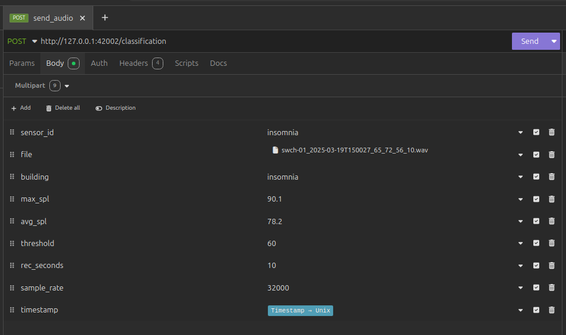

    <h1 >
      Noise Source Classification at the Edge
    </h1>
    <h3>
        
        
        
  </h3>
  

  

     
    

## Table of contents
* [General info](#general-info)
* [Technologies](#technologies)
* [Documentation](#documentation)
* [Testing](#testing)
* [Acknowledgments](#acknowledgments)

## General info

**Swarmchestrate** is a decentralized, autonomous, and self-organizing system for managing application containers across a distributed network of devices. It enables dynamic load balancing based on real-time metrics such as CPU usage, memory, and network latency. By supporting edge computing, Swarmchestrate allows privacy-preserving and scalable data processing—like machine learning inference—close to where data is generated, minimizing transmission overhead and improving responsiveness.

In the **InnoRenew CoE** demonstrator, Swarmchestrate orchestrates sound classification tasks across a network of Raspberry Pi devices acting as sound sensors. These devices operate under varying environmental conditions (e.g., direct sunlight), which may affect their thermal performance. Swarmchestrate mitigates such challenges by adaptively redirecting tasks to nodes with lower temperatures and available computational capacity. This ensures sustained performance, avoids thermal throttling, and enhances the overall reliability and lifespan of the devices.

This repository contains the code for the sound classification container managed by Swarmchestrate.

## Technologies

- Docker
- InfluxDB
- [EfficientAT](https://github.com/fschmid56/EfficientAT)

## Docker image

Available at [dockerhub](https://hub.docker.com/repository/docker/nikih94/audio_classification/)

Images built for:
- amd64
- arm64v8 (raspberryPI)

## Documentation

The program is structured around three main components: HTTP server, inference and result manager.
- [The HTTP server](src/server.py) listens for incoming HTTP POST requests structured as described in section [API](###api).
- [The inference](src/inference.py) component manages the audio preprocessing, model loading and inference.
- [The result manager](result_manager.py) is responsible of inserting classification results into an InfluxDB instance.

This repository relies on the pre-trained CNNs from [EfficientAT](https://github.com/fschmid56/EfficientAT), a collection of efficient audio transformers and CNN models. These models were trained on [AudioSet](https://research.google.com/audioset/), a large-scale dataset of labeled 10-second audio clips released by Google. AudioSet covers a wide range of environmental and human-made sound classes, making the models suitable for robust real-world audio classification tasks.

### List of the available models

| Model Name        | Params (Millions) | MACs (Billions) | Performance (mAP) |
|-------------------|-------------------|-----------------|-------------------|
| dymn04_as         | 1.97              | 0.12            | 45.0              |
| dymn10_as         | 10.57             | 0.58            | 47.7              |
| dymn20_as         | 40.02             | 2.2             | 49.1              |
| mn04_as           | 0.983             | 0.11            | 43.2              |
| mn05_as           | 1.43              | 0.16            | 44.3              |
| mn10_as           | 4.88              | 0.54            | 47.1              |
| mn20_as           | 17.91             | 2.06            | 47.8              |
| mn30_as           | 39.09             | 4.55            | 48.2              |
| mn40_as           | 68.43             | 8.03            | 48.4              |

### Configuration File

The application behavior is defined via a configuration file named `configuration.ini`. This file specifies the audio classification model and InfluxDB connection parameters.
A template is given in the [configuration_template.ini](configuration_template.ini) file.

#### `[classification]`

Configuration for the audio classification model.

- `model_name`: Name of the pre-trained CNN model to use for inference. (e.g.,  `dymn04_as`)
- `window_size`: Window size in milliseconds of inference processing. (e.g., `800`).
- `hop_size`: Hop size for next window processing in milliseconds. (e.g., `320`).

#### `[influx2]`

Configuration for writing data to InfluxDB v2.

- `url`: URL of the InfluxDB server.
- `org`: Name of the InfluxDB organization.
- `token`: Access token for authentication.
- `data_bucket`: Name of the bucket where classification results are stored.

### API

#### `POST /classification`

This endpoint receives an audio recording along with metadata and queues it for classification.

##### Request

- **Content-Type:** `multipart/form-data`
- **Form Fields:**
  - `sensor_id` (string): Unique identifier of the sensor.
  - `building` (string): Name or code of the building where the sensor is located.
  - `max_spl` (float): Maximum sound pressure level measured during recording.
  - `avg_spl` (float): Average sound pressure level measured during recording.
  - `threshold` (float): Sound threshold used for triggering the recording.
  - `rec_seconds` (int): Duration of the recording in seconds.
  - `sample_rate` (int): Sampling rate of the audio (e.g., 32000).
  - `timestamp` (string): Unix timestamp at the recording capturing.
  - `file` (binary): The audio file (e.g., WAV format) to be classified.

### InfluxDB Data Schema

After classification, metadata about each processed audio recording is stored in InfluxDB for monitoring and analysis.

#### Measurement

- **`classification`**

#### Tags

- `sensor_id` – Identifier of the sensor device (e.g., `raspi-01`)
- `building` – Location or building identifier (e.g., `Grand Hotel Koper`)

#### Fields

- `max_spl` (float) – Maximum sound pressure level during recording
- `avg_spl` (float) – Average sound pressure level during recording
- `threshold` (float) – SPL threshold used to trigger recording
- `result` (string) – Predicted sound class (e.g., `traffic`, `voice`, `construction`)
- `result_p` (float) – Confidence score of the prediction (0.0–1.0)
- `inference_time_ms` (int) – Time taken for audio inference in milliseconds

### Timestamp

- The exact time the audio was recorded, as reported in the `timestamp` field of the request.

## Testing

### Docker-compose

A [docker-compose](docker-compose.yml) file is provided to show configuration-file and port mapping.

### API

Audio files are provided for testing, located in the folder [sample_audio](sample_audio).

You can test the HTTP API using tools like [Postman](https://www.postman.com/) or [Insomnia](https://insomnia.rest/).
The following figure shows how to setup the api call.
The following fields can be set to arbitrary values: sensor_id, building, max_spl, avg_spl, threshold, rec_seconds.
Sample rate should match the audio recording, provided samples are at 32kHz.

## Acknowledgments

This work was funded by the European Commission’s Horizon programme within the Swarmchestrate project, (project no. 101135012).
